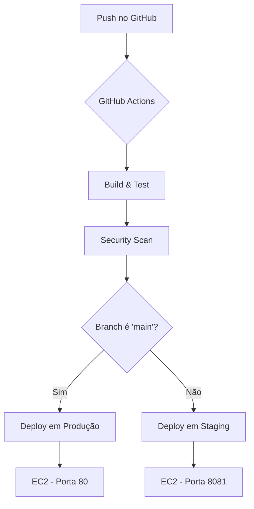

# Desafio Lacrei Saúde - DevSecOps Pipeline
 
Este projeto implementa um pipeline de CI/CD (Integração e Entrega Contínua) completo e seguro para uma aplicação Node.js simples, utilizando Docker, GitHub Actions e AWS. O objetivo é demonstrar as boas práticas de DevSecOps, desde o build automatizado até o deploy em múltiplos ambientes na nuvem.

## 🏛️ Arquitetura da Solução

A solução é composta pelas seguintes tecnologias:

*   **Aplicação:** API simples em Node.js com Express.
*   **Containerização:** Docker, para empacotar a aplicação e suas dependências.
*   **CI/CD:** GitHub Actions, para orquestrar todo o fluxo de automação.
*   **Hospedagem de Imagens:** Docker Hub, para armazenar as imagens Docker geradas.
*   **Infraestrutura na Nuvem:** AWS EC2, para hospedar os ambientes de Staging e Produção.

## 🔄 Fluxo de CI/CD

O pipeline é acionado a cada `push` em qualquer branch do repositório. Ele é dividido em jobs que garantem a qualidade e a segurança do código antes do deploy.



1.  **Build & Test:** O código é verificado, as dependências são instaladas e os testes unitários (`npm test`) são executados.
2.  **Security Scan:** Uma imagem Docker da aplicação é construída e analisada em busca de vulnerabilidades usando o **OWASP ZAP**.
3.  **Deploy:** Se os passos anteriores forem bem-sucedidos, o deploy é realizado:
   *   **Branch `main`:** A imagem Docker é enviada para o Docker Hub e o deploy é feito no ambiente de **Produção**, rodando na porta `80`.
   *   **Outras Branches:** O deploy é feito no ambiente de **Staging**, rodando na porta `8081` da mesma instância EC2.
 
## ⚙️ Setup dos Ambientes

### Pré-requisitos

*   Conta no GitHub
*   Conta na AWS (com acesso para criar instâncias EC2 e usuários IAM)
*   Conta no Docker Hub
*   Node.js e npm instalados localmente

### 1. Configuração da Infraestrutura (AWS)

Foi utilizada uma única instância EC2 para hospedar os dois ambientes, visando a otimização de custos de assinatura AWS, com isolamento por portas.

1.  **Criar Instância EC2:**
    *   **AMI:** Amazon Linux 2
    *   **Tipo:** `t2.micro` (elegível para o nível gratuito)
    *   **Script de User Data:** Um script foi adicionado para instalar e iniciar o Docker automaticamente na primeira inicialização.
2.  **Configurar Security Group:**
    *   Liberar a porta `22` (SSH) para `0.0.0.0/0` para permitir o deploy via GitHub Actions. A segurança é garantida pela exigência de uma chave SSH privada, que é mantida em segredo.
    *   Liberar a porta `80` (HTTP - Produção) para o mundo (`0.0.0.0/0`).
    *   Liberar a porta `8081` (Custom TCP - Staging) para o mundo (`0.0.0.0/0`).
3.  **Criar Usuário IAM:**
    *   Um usuário programático (`github-deployer`) foi criado com a política `AmazonEC2FullAccess` para permitir que o GitHub Actions gerencie a instância.

### 2. Configuração dos Segredos (GitHub Secrets)

As seguintes credenciais foram configuradas em **Settings > Secrets and variables > Actions** no repositório do GitHub:


*   `DOCKER_USERNAME`: Nome de usuário do Docker Hub.
*   `DOCKER_PASSWORD`: Token de acesso do Docker Hub (recomendado) ou a senha.
*   `EC2_KEY`: O **conteúdo completo** da sua chave privada `.pem`, incluindo as linhas `-----BEGIN...` e `-----END...`.
*   `EC2_HOST`: Endereço IP público da instância EC2.
*   `EC2_USER`: Usuário da instância EC2 (padrão `ec2-user`).

## 📝 Registro de Erros e Decisões

*   **Decisão:** Utilizar uma única instância EC2 para ambos os ambientes.
    *   **Motivo:** Cumprir o requisito de ter ambientes de Staging e Produção de forma funcional, mas sem gerar custos, visto que o nível gratuito da AWS cobre apenas uma instância `t2.micro` rodando 24/7. O isolamento foi feito por portas (`80` para produção, `8081` para staging).
*   **Decisão:** Usar o hash do commit como tag da imagem Docker.
    *   **Motivo:** Garante a imutabilidade e o rastreamento de cada deploy. A tag `:latest` também é atualizada para facilitar o desenvolvimento, mas o deploy em si usa a tag do commit, o que é crucial para o processo de rollback.
*   **Erro Encontrado:** O pipeline falhava no passo de "Wait for Application" com `sleep`.
    *   **Solução:** O `sleep` foi substituído por um loop de `curl` que verifica ativamente a rota `/status`. Isso tornou o pipeline mais rápido e resiliente, continuando assim que a aplicação está pronta, em vez de esperar um tempo fixo.

## ⏪ Processo de Rollback

O rollback pode ser executado de forma segura e controlada diretamente pelo GitHub Actions, graças ao versionamento das imagens Docker com o hash do commit.

**Passos para o Rollback:**

1.  Navegue até a aba **Actions** do repositório.
2.  Na lista de workflows, selecione **"DevSecOps Pipeline"**.
3.  Encontre a execução (run) bem-sucedida do commit que você deseja restaurar. Anote o **hash do commit** (ex: `a1b2c3d`).
4.  Volte para a página principal do workflow e clique no botão **"Run workflow"**.
5.  No campo **"Use workflow from"**, selecione a branch alvo do rollback (ex: `main` para produção) e cole o **hash do commit** anotado.
6.  Clique em **"Run workflow"**.

O pipeline será executado novamente, mas fará o checkout do código antigo, construirá a imagem Docker correspondente àquela versão e a implantará no ambiente correto, efetivamente revertendo a aplicação para um estado anterior estável.

## 🛡️ Checklist de Segurança Aplicado

*   [x] **Gerenciamento de Segredos:** Todas as credenciais (AWS, Docker Hub, Chave SSH) são armazenadas de forma segura no GitHub Secrets e nunca expostas no código ou nos logs.
*   [x] **Análise de Vulnerabilidades (SAST/DAST):** O pipeline integra o **OWASP ZAP** para realizar uma análise dinâmica na aplicação em busca de vulnerabilidades comuns a cada build.
*   [x] **Políticas de Acesso Restritivas:** O Security Group da instância EC2 segue o princípio do menor privilégio, liberando o acesso SSH apenas para IPs conhecidos e expondo apenas as portas necessárias para a aplicação.
*   [x] **Configuração de CORS:** A aplicação foi configurada com o middleware `cors` para permitir que seja consumida por aplicações de front-end de outras origens.
*   [ ] **Uso de HTTPS/TLS:** A configuração de um Application Load Balancer com um certificado SSL foi planejada, mas deixada como um próximo passo para habilitar o tráfego criptografado (ver seção "Próximos Passos").

## 🚀 Setup e Execução
 
### Configuração do Pipeline
1.  Clone este repositório:
    ```bash
    git clone https://github.com/seu-usuario/desafio-lacrei-saude.git
    ```
2.  Instale as dependências:
    ```bash
    npm install
    ```
3.  Execute os testes para validar o ambiente:
    ```bash
    npm test
    ```
